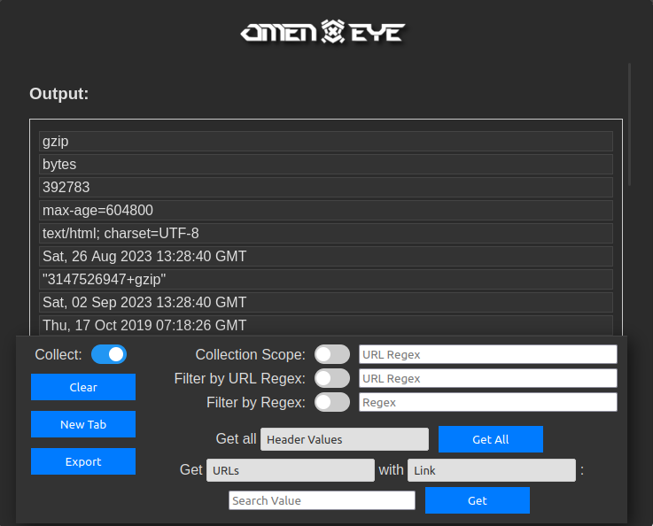

  

**Omen Eye** is a specialized Firefox browser extension designed for penetration testers and cybersecurity experts. It aids in scraping vital website information during attack surface mapping and perimeter walks, providing an insightful "pseudo-relational database" approach to quickly navigate and analyze website data.

 
 

  

 
 

## Features

### Core Capabilities

- **Collect Switch**: Toggle between starting or stopping information collection.
- **Collection Scope**: Use regex to specify which URLs to scrape from.
- **Clear**: Remove all stored information with one click.
- **New Tab**: View Omen Eye in a standalone tab.
- **Export**: Save your data by exporting it as a JSON file.
- **Import**: Bring back previously saved data from a JSON file (Only visible when Omen Eye is opened in a tab).
- **Filter by URL Regex**: Filter output based on URL origin.
- **Filter by Regex**: Use regex to filter your output.

### Retrieval Functionality

- **Get all X**: Choose the kind of information you want to view.
- **Get X for/with Y**: Use two dropdown menus to specify the information and the key to retrieve it. For instance, retrieving all headers associated with a specific URL.

### Information Coverage

Omen Eye is comprehensive in its data collection, including:

- **URLs**
- **Links**
- **Response Headers & Header Values**
- **Post Bodies, Parameters & Values**
- **Inputs, Input Values & Tags**
- **Query Parameters & Values**

## Installation 
**WARNING**: This extension is currently unsigned. If you do not feel comfortable installing an unsigned extension, stop here and do not proceed any further.
Because it is unsigned, you need a developer versions of Firefox to install it permanently. If you do not have the dev version, you can find a tutorial on how to install [here](https://tecadmin.net/install-firefox-developer-edition-on-ubuntu/).

If you do not know how to side-load unsigned browser extensions, learn how [here](https://support.mozilla.org/en-US/kb/add-on-signing-in-firefox?as=u&utm_source=inproduct).

The short "how-to" is to open the dev version of Firefox, type in `about:config` in the address bar, set the `xpinstall.signatures.required` setting to `false`, and then you are good to install from file.

## Usage

1. Click on the Omen Eye icon to start.
2. Navigate to a website.
3. Use the Collect Switch to begin collecting data.
4. Interact with the website as you normally would. Omen Eye will gather data in the background.
5. Open the extension again to view the collected information and use various features to analyze the data.

## Disclaimer

Please remember to use Omen Eye ethically and responsibly.

## To Do
- Catch, store, and search for request headers and values instead of just response headers
- "Post Bodies" is a bit broken ATM in how it collect the post info, does not collect some formats such as JSON, XML, etc.
